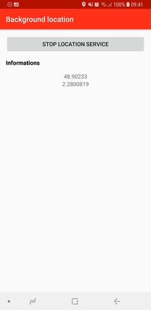

# Android Background Location Service

The idea of this project is to learn how to set up Android Background Location Service in an android project.

Receive location updates both while your app is in the foreground, and after the app has exited.

This code is based on the documentation Android Training Location :
https://developer.android.com/training/location/

## Screenshots

## Libraries Used

* Architecture Components
  * [Data Binding][0] - Declaratively bind observable data to UI elements.
  * [Lifecycles][1] - Manage your activity and fragment lifecycles.
  * [LiveData][2] - Notify views when underlying database changes.
  * [ViewModel][3] - Manage UI-related data in a lifecycle-conscious way.
  * [Location][4] - To get a geographic location.

[0]: https://developer.android.com/topic/libraries/data-binding/
[1]: https://developer.android.com/topic/libraries/architecture/lifecycle
[2]: https://developer.android.com/topic/libraries/architecture/livedata
[3]: https://developer.android.com/topic/libraries/architecture/viewmodel
[4]: https://developer.android.com/reference/android/location/Location

## Support

If you've found an error in this sample, please file an issue: https://github.com/mlabar/android-background-location-service/issues

Thanks for your feedback!

Note : This sample project require Android SDK 24 min
